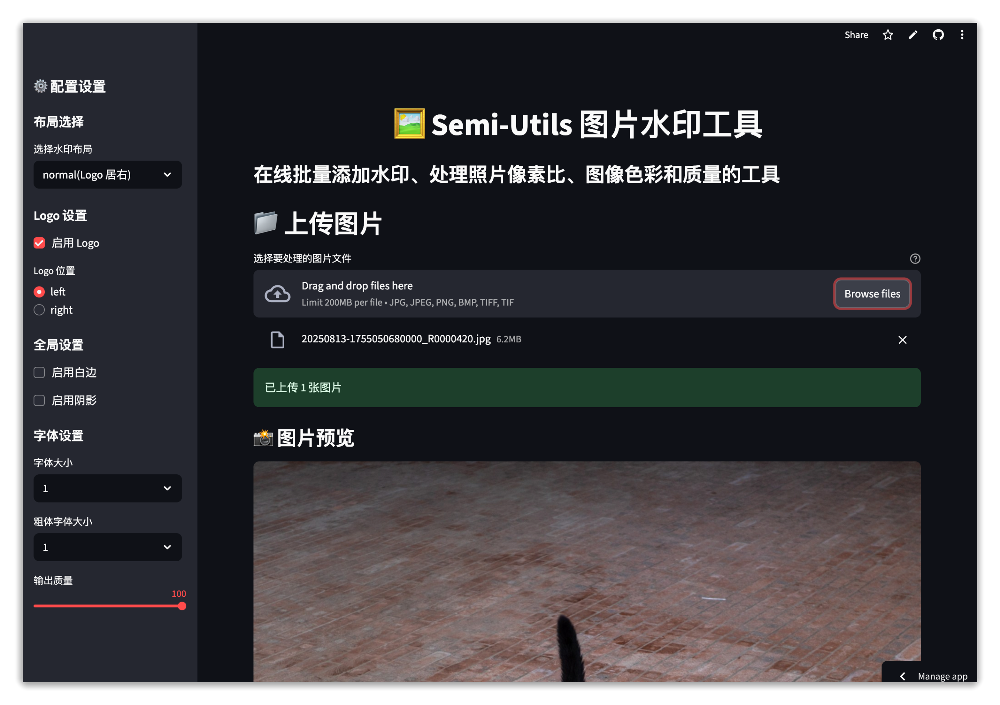

# Semi-Utils Web

> 🖼️ 基于 Streamlit 构建的在线批量图片水印工具

[](https://github.com/yzxoi/semi-utils-web/stargazers)
[](https://github.com/yzxoi/semi-utils-web/network)
[](LICENSE)



## 🌟 特性

- **🌐 在线使用**: 无需安装，直接在浏览器中使用
- **📦 批量处理**: 支持同时上传多张图片进行批量处理
- **🎨 多种布局**: 支持所有桌面版的水印布局
- **👀 实时预览**: 上传后立即预览图片
- **⬇️ 即时下载**: 处理完成后可直接下载单张或打包下载
- **📱 响应式设计**: 适配各种屏幕尺寸
- **⚙️ 灵活配置**: 实时调整所有设置参数

## 🚀 快速开始

### 在线使用 (推荐)

1. **访问在线应用**
   - 直接访问 DEMO (On Streamlit): [semi-utils.streamlit.app](https://semi-utils.streamlit.app/)
   - 或使用其他部署平台自行部署 (详见 [部署指南](DEPLOYMENT.md))

2. **上传图片**
   - 支持 JPG, PNG, BMP, TIFF 格式
   - 可以同时选择多张图片

3. **配置设置**
   - 选择水印布局
   - 调整 Logo、白边、阴影等效果
   - 设置字体大小和输出质量

4. **处理并下载**
   - 点击"开始处理图片"
   - 查看实时处理进度
   - 下载处理后的图片

### 本地运行

1. **克隆仓库**
   ```bash
   git clone https://github.com/yzxoi/semi-utils-web.git
   cd semi-utils
   ```

2. **安装依赖**
   ```bash
   pip install -r requirements.txt
   ```

3. **启动应用**
   ```bash
   python run_web.py
   # 或
   streamlit run app.py
   ```

4. **访问应用**
   打开浏览器访问: http://localhost:8501

## 📱 使用说明

### 1. 上传图片
- 点击上传区域选择图片文件
- 支持 JPG, PNG, BMP, TIFF 格式
- 可以同时选择多张图片

### 2. 配置设置
在左侧边栏可以调整：
- **布局选择**: 选择不同的水印布局
- **Logo 设置**: 启用/禁用 Logo，设置位置
- **全局设置**: 白边、阴影等效果
- **字体设置**: 字体大小调整
- **输出质量**: 控制最终图片质量

### 3. 处理图片
- 点击"开始处理图片"按钮
- 查看实时处理进度
- 处理完成后预览结果

### 4. 下载结果
- **单个下载**: 点击每张图片的下载链接
- **批量下载**: 下载包含所有处理后图片的 ZIP 文件

## 🎨 布局效果展示

||||
|-|-|-|
||||
||||
||||

## 🛠️ 技术栈

- **前端**: Streamlit
- **图像处理**: Pillow (PIL)
- **配置管理**: PyYAML
- **文件处理**: Python 标准库

## 📁 项目结构

```
semi-utils/
├── app.py                    # 🌟 Streamlit 主应用
├── run_web.py               # 🚀 启动脚本
├── test_web.py              # 🧪 测试脚本
├── requirements.txt         # 📦 Python 依赖
├── config.yaml              # ⚙️ 配置文件
├── .streamlit/              # ⚙️ Streamlit 配置
│   └── config.toml
├── entity/                  # 🔧 核心业务逻辑
├── enums/                   # 📋 枚举定义
├── fonts/                   # 🔤 字体文件
├── logos/                   # 🏷️ Logo 文件
├── images/                  # 🖼️ 示例图片
├── README.md                # 📖 本文档
├── README_WEB.md            # 📖 Web 版本详细说明
├── DEPLOYMENT.md            # 🚀 部署指南
└── LICENSE                  # 📄 Apache-2.0 许可证
```

## 🌐 部署指南

### Streamlit Cloud (推荐)

1. **Fork 本仓库**到你的 GitHub 账号
2. **注册 Streamlit Cloud**: 访问 [share.streamlit.io](https://share.streamlit.io)
3. **连接仓库**并设置主文件为 `app.py`
4. **设定 Python 版本**为 3.12
5. **点击部署**，获得公开链接

### 其他平台

- **Heroku**: 详见 [DEPLOYMENT.md](DEPLOYMENT.md)
- **Railway**: 详见 [DEPLOYMENT.md](DEPLOYMENT.md)
- **Vercel**: 详见 [DEPLOYMENT.md](DEPLOYMENT.md)

## 🔧 自定义配置

### 修改默认设置
编辑 `config.yaml` 文件:

```yaml
layout:
  type: watermark_right_logo  # 默认布局
  logo_enable: true          # 默认启用 Logo
  logo_position: right       # Logo 位置

global:
  white_margin:
    enable: false            # 默认不启用白边
    width: 3
  shadow:
    enable: false            # 默认不启用阴影
```

### 添加自定义 Logo
1. 将 Logo 文件放入 `logos/` 目录
2. 在 `config.yaml` 中配置品牌信息

## 🤝 贡献

欢迎提交 Issue 和 Pull Request！

### 开发环境设置

1. 克隆仓库
2. 安装依赖: `pip install -r requirements.txt`
3. 运行测试: `python test_web.py`
4. 启动开发服务器: `streamlit run app.py --server.runOnSave true`

## 📄 许可证

本项目采用 **Apache License 2.0** 许可证 - 查看 [LICENSE](LICENSE) 文件了解详情。

## 🙏 致谢

### 原项目
本项目基于 [leslievan/semi-utils](https://github.com/leslievan/semi-utils) 的桌面版本开发，感谢原作者 [@leslievan](https://github.com/leslievan) 提供优秀的图片处理工具。

### 开源组件
- **Streamlit**: 用于构建 Web 应用界面
- **Pillow (PIL)**: 图像处理库
- **PyYAML**: YAML 配置文件处理
- **exiftool**: EXIF 信息读取 (基于 GPL v1 + Artistic License 2.0)

### 字体资源
- **阿里巴巴普惠体**: 用于中文显示
- **Roboto**: 用于英文显示

### 辅助开发工具
本项目在开发过程中，部分代码与文档撰写参考了 AI 辅助工具 的建议与生成内容，主要包括但不限于：
- Cursor / Copilot 类编辑器辅助
- ChatGPT（GPT-5 Thinking 系列）
- Gemini CLI（2.5 Pro & Flash）。

请务必在项目学习与使用过程中，知悉事实性偏差。

## 📞 支持

- 📖 查看 [README_WEB.md](README_WEB.md) 了解详细使用
- 🚀 查看 [DEPLOYMENT.md](DEPLOYMENT.md) 了解部署方法
- 🐛 提交 [Issue](https://github.com/yzxoi/semi-utils-web/issues) 报告问题
- 💡 提交 [Pull Request](https://github.com/yzxoi/semi-utils-web/pulls) 贡献代码